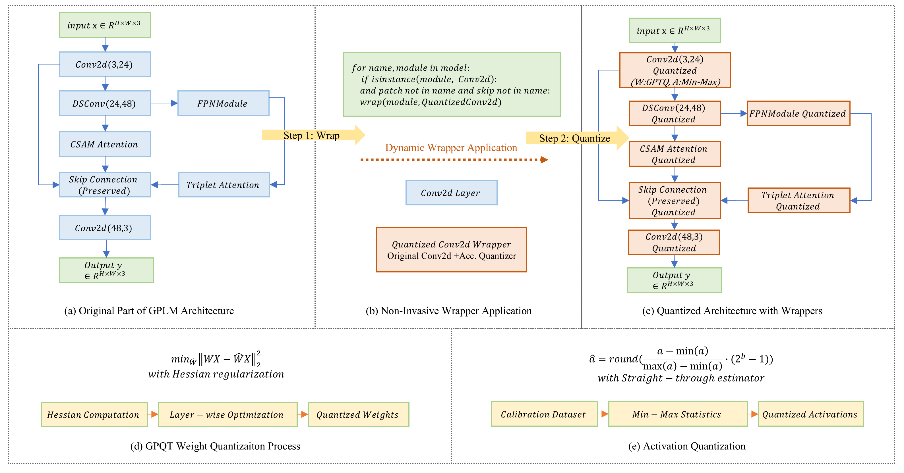

# GPLMv2
GPLMv2: An Edge-Ready Post-Training Quantization Framework for Deploying Complex Underwater Image Enhancement Models

saved_model.rar: https://drive.google.com/file/d/1JO2HfVCz13Nrt-oIlui0VjkzA0GbIQdH/view?usp=sharing

results: https://drive.google.com/file/d/1qk4w-eltNq0BCFap9PcG9brTXP8NgzSw/view?usp=drive_link

Dr. Jinxin SHAO
2025/9/1
